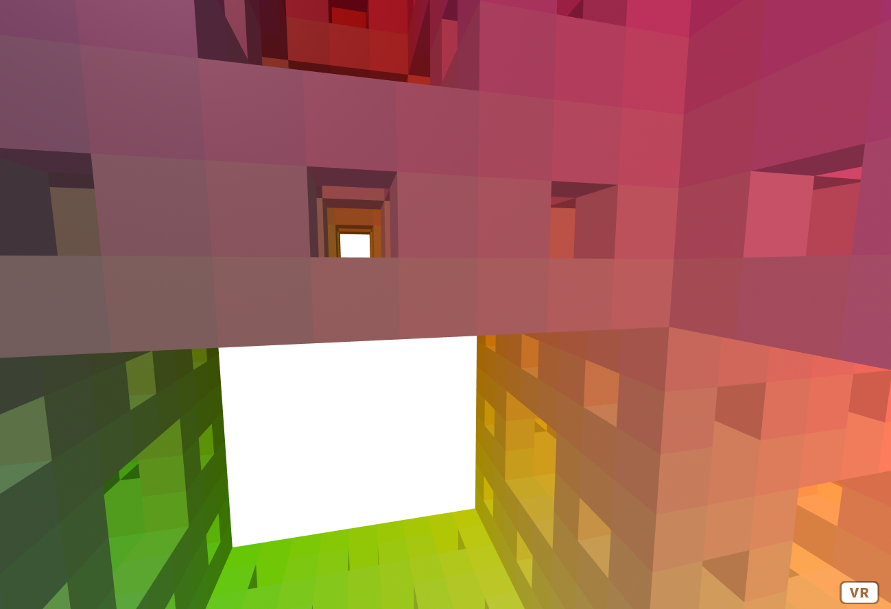

# Menger Sponge - 3D Fractal VR - A-Frame

My *Hello VR World* built with [A-Frame](https://aframe.io), a web framework for building virtual reality experiences.
It shows a [Menger sponge fractal](https://en.wikipedia.org/wiki/Menger_sponge) from the inside.

Click and drag on desktop. Open it on a smartphone and use the device motion sensors. Or [plug in a VR headset](https://aframe.io/docs/1.0.0/introduction/vr-headsets-and-webvr-browsers.html!

To play with code, [the easiest way is to live edit it here](https://glitch.com/~arrow-woozy-period).

